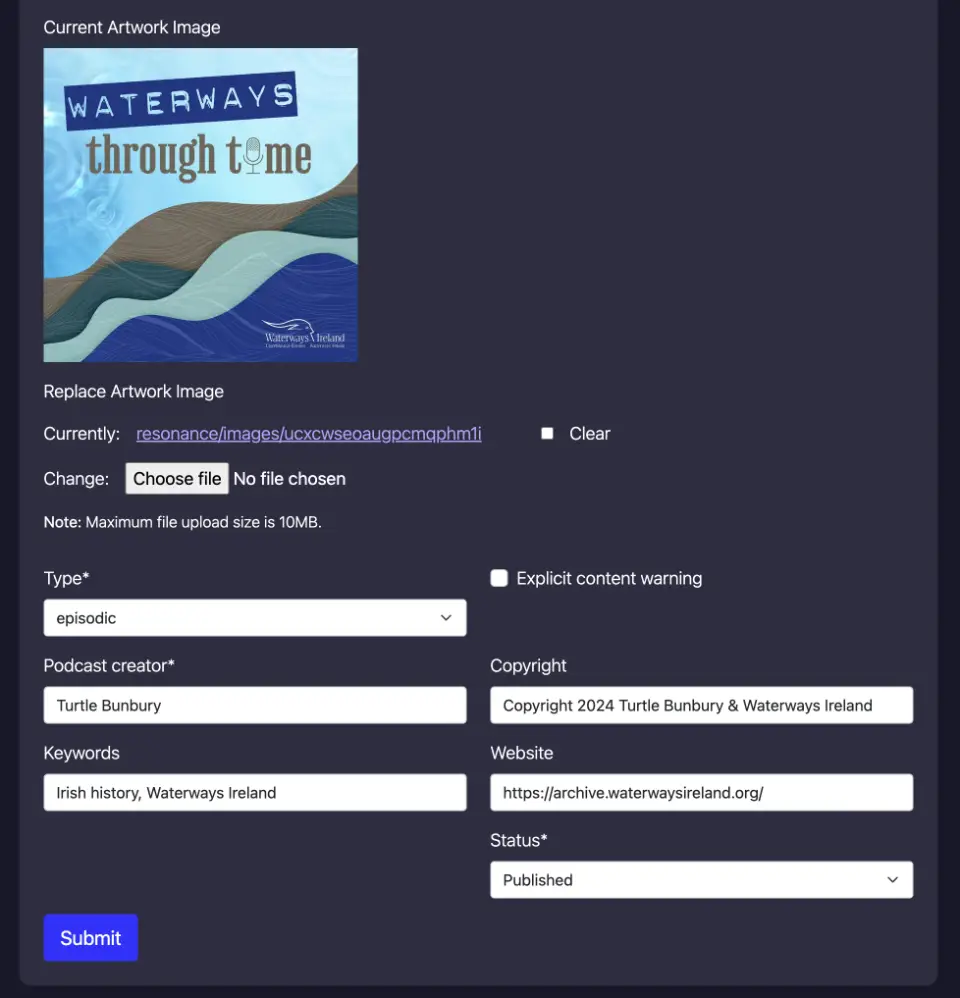

# Resonance Podcaster

Resonance Podcaster is a podcast publishing tool that allows podcasters to create and publish podcasts. Once signed up, a podcaster can create a podcast to which episodes can be added as mp3 audio files. Once a podcast episode has been uploaded and the podcast published, a public RSS Feed for the podcast is generated, which listeners can add to their podcast players to download existing episodes or to subscribe to future episodes.

[View the live site here](https://resonance-podcaster-fe27f8eb1c9a.herokuapp.com/)

## Table of contents

- [Design & User Experience](#ux)
- [Future Features](#future-features)
- [Agile Development](#agile)
- [Technologies](#technologies)
- [Database Design](#db)
- [Testing](#testing)
- [Deployment](#deployment)
- [Credits](#credits)
- [Acknowledgements](#acknowledgements)

## Design & User Experience

### Site Goals

The primary goal for this site is to make it super easy for anyone to publish a podcast, and to achieve this I have taken a clean and minimal approach to the design. In addition to publishing podcasts, listeners can also browse a list of recently published podcasts from the home page. 

### Colour
By adopting a subtle, modern and predominantly dark colour palette that ranges from light purple to deep blue tones, contrasted with darker grayscale shades, I have attempted to create a visually strong color scheme that enhances the usability of the site and consumes less energy while be displayed on devices.

  

### Typography
The app is using System UI, a [system or web-safe sans-serif font](https://fonts.google.com/knowledge/glossary/system_font_web_safe_font) that invokes Segoe on Windows, San Francisco on macOS, and Roboto on Android. This results is a fast loading page that is clean, minimal and easy to read, with fewer layout shifts that can be caused slower loading web-fonts.

### Wireframes
    

## User Stories
The user stories for the app were added as issues to a Kanban board which was set up on the [Github project here](https://github.com/bristlebird/resonance/projects). Further detail on the agile development process used can be seen [here](#agile)

## Features
### Pages

- **Home page** — main entry point for the app, displaying a grid of recently published podcasts to give listeners and potential podcasters a sense of what can be achieved by the app. A vibrant 'Get Started' at the top right of the page provides the call to action to invite podcasters to sign up and give it a try.
``USER STORY: View paginated list of podcasts — As a site user I can view a paginated list of podcasts so that ** I can choose which podcast to listen or subscribe to.**``

- **About page** — A simple page with information about the podcast publishing service provided by Resonance. The image of a boy shouting or singing into a microphone is designed to encourage anyone to give their voice and ideas a platform to build an audience.
``USER STORY: Read about the site — As a Site user I can click an about link so that I can read about the app & its developer.``

- **Podcast detail page** — On this page, a visitor to the site can read a description of the podcast, see who the author is, listen to individual episodes and subscribe to it via the RSS Subscribe button.
``USER STORY: Listen to a podcast  — As a Site User, I can click on a podcast so that I can listen or subscribe.``
``USER STORY: Subscribe to a podcast — As a Site User, I can subscribe to a podcast RSS feed so that new episodes are automatically added to my podcast player when published.``

- **User account registration :: Get started** — Podcasters can sign up to create an account so that they can login to add podcasts & upload episodes.
``USER STORY: Account registration — As a Site User I can register an account so that I can create a podcast & upload epsiodes.``

- **User login :: Sign in** — Registered users can sign in to their account so that they can add new podcasts or edit and manage existing ones. Once logged in the 'Sign in' link and 'Get started' button at the top right are replaced with the username of logged in user that contains dropdown of links to 'My Podcasts' dashboard page and Logout.

- **Logout** — Hitting the logout link from the username dropdown menu takes them to a confirmation logout page. Once they confirm 'Yes, Log me out!', they're redirected to the home page where a message confirms 'You have been signed out' and the navigation menu links are switched back to 'Sign in' and 'Get started'.

- **Dashboard :: My Podcasts** — Once logged in, the registered podcaster can visit the 'My Podcasts' / dashboard page (from the username dropdown menu) to view and manage their existing podcasts or to add new ones.
``USER STORY: List all podcasts that can be managed by logged in user — As a site user / podcast creator I can click a my podcasts / dashboard link so that I can view all the podcasts & episodes I've added``

- **Podcast detail page :: Logged in** — Podcasters use this page to manage an existing podcast: they can hit the edit button to update the podcast details or hit the delete button to delete the podcast. Hitting 'delete' invokes a confirmation modal that informas the user that the action cannot be undone and requires them to confirm  before the podcast is deleted (defensive programming). The podcaster can also add new episodes to the podcast form this page by hitting the 'Add new' button inthe Epsiodes section, as well as edit or delete existing epsiodes if any have already been added. Episode deletion also requires a confirmation step.
``USER STORY: Delete a podcast — As a logged in user I can delete a podcast so that it can be removed from subscribers feeds if deemed necessary for any reason``
``USER STORY: Delete an episode — As a logged in user I can delete an episode from one of my podcasts so that maintain the integrity of my podcast content should it be deemed inappropriate or irrelevant ``

 

- **Add New Podcast :: Logged in** —  Form page that the Podcaster uses to add details about a new podcast. Only the title, description, excerpt, creator, artwork, published state are visible from the website, the rest of the fields (type, explicit content warning, copyright, keywords and website) are added to the Podcast RSS feed. When the details are submitted, the user is redirected to the newly created podcast detail page.
``USER STORY: Add a podcast — As a site user / podcast creator I can add a new podcast so that I can publish some recently recorded episodes``

 
 

- **Edit Podcast :: Logged in** —  Form page that the Podcaster uses to edit an existing podcasts details. When the details are submitted, the user is redirected to the updated podcast detail page.
``USER STORY: Modify / Update a podcast  — As a site user / podcast creator I can edit my podcast settings and description so that it can be made more relevant to my intended audience``

 
 

- **Add New Episode :: Logged in** —  Form page that the Podcaster uses to add new episode details and upload an mp3 audio file of the episode. When the details are submitted, the user is redirected to the podcast detail page.
``USER STORY: Create / add podcast episodes — As a Podcast creator I can create episodes and add them to my podcast so that they can be distributed on the podcast RSS feed.``

 

- **Edit Episode :: Logged in** —  Form page that the Podcaster uses to edit an existing podcast epsiode. When the updated details are submitted, the user is redirected to the podcast detail page.
``USER STORY: Edit podcast episodes — As a Site User / Pocast creator I can update an existing podcast episode so that I correct or change episode content.``

 

- **Custom Error pages** —  basic pages were created for 403, 404 and 500 errors.

## Future features & improvements
- Parse the duration of the audio mp3 file to include in the podcast feed.
- Allow larger audio file uploads to Cloudinary so full length episodes can be published (requires Cloudinary paid plan).
- Add categories to the Podcast model, to enable podcasters to choose category & sub-category (required in order to be able to submit feed to podcast  directories such as Apple Podcasts, Spotify, etc).
- Update page titles and meta descriptions from database models to reflect content on the page for better SEO.
- Develop user account management, profile and password reset functionality.
- Add payment plans & donations to the platform to cover the costs of hosting the site and media files.
- Allow listeners to search and filter published podcasts by category, keywords and tags.
- Performance improvements & recommendations from Google Lighthouse: 
	- use cloudinary image transformations to output responsive images and set correct image width and height
	- minify javascript & css
	- remove unused bootstrap styles & js
	- [enable text compression on heroku (gzip, deflate, brotli)](https://developer.chrome.com/docs/lighthouse/performance/uses-text-compression/)

## Agile Development

Agile methodologies were used to deliver the product MVP. [Github Projects](https://github.com/bristlebird/resonance/projects) and [Issues](https://github.com/bristlebird/resonance/issues) provided the agile tools to create a basic Kanban board on which tasks and user stories were tracked throughout the project development.

MoSCoW prioritisation was used with the aid of Github project labels to streamline and prioritise tasks during development. To deliver the MVP, core requirements were tackled first, so the primary focus was given to 'must haves', followed by 'should haves' and finaly 'could haves'.

Each user story appears as a card on the kanban board with a set of acceptance criteria — this provided a task driven approach to see the project through.

## Technologies
- HTML / CSS / JavaScript — standard front end web technologies used to build out the responsive user interface
- [Bootstrap](https://getbootstrap.com/) — open-source CSS framework directed at responsive, mobile-first front-end web development
- [Python](https://www.python.org/) — main backend progamming language used for application logic
- [Django](https://www.djangoproject.com/) — Python MVC framework for building back end web app functionality
- [PostgreSQL](https://www.postgresql.org/) — object relational database system for storing app content and models
- [Heroku](https://heroku.com/) — for app deployment & hosting
- [Git](https://git-scm.com/) — for version control
- [Github](https://github.com/bristlebird/time-lord) — for code storage / this repository
- [Gitpod](https://gitpod.io/) & [Visual Studio Code for Mac](https://code.visualstudio.com/) — IDE used to write the code
- [Code Institute's full template for Gitpod](https://github.com/Code-Institute-Org/ci-full-template) 

### Python Modules, Packages, Libraries & Frameworks:
- [asgiref](https://pypi.org/project/asgiref/) — standard interface between async-capable Python web servers, frameworks, and applications
- [cloudinary](https://pypi.org/project/cloudinary/) — integrates app with Cloudinary for image & medai file storage and manipulation
- [crispy-bootstrap5](https://pypi.org/project/crispy-bootstrap5/) — form template packs to add Bootstrap styling
- [dj-database-url](https://pypi.org/project/dj-database-url/) — utility for connecting Django to PostgreSQL
- [dj3-cloudinary-storage](https://pypi.org/project/dj3-cloudinary-storage/) — Django package that facilitates integration with Cloudinary by implementing Django Storage API
- [django-allauth](https://docs.allauth.org/en/latest/) — used for account management, authentication & registration
- [django-crispy-forms](https://pypi.org/project/django-crispy-forms/) — used to render forms HTML
- [django-summernote](https://pypi.org/project/django-summernote/) — adds wysiwyg / rich text editor to form textfields
- [gunicorn](https://gunicorn.org/) — a Python WSGI HTTP Server
- [oauthlib](https://pypi.org/project/oauthlib/) — authentication library dependancy used by allauth package
- [psycopg2](https://pypi.org/project/psycopg2/) — PostgreSQL database adapter
- [PyJWT](https://pypi.org/project/PyJWT/) — Python library which allows you to encode and decode JSON Web Tokens
- [python3-openid](https://pypi.org/project/python3-openid/) — set of Python packages to support use of the OpenID, dependenancy of allauth
- [requests-oauthlib](https://pypi.org/project/requests-oauthlib/) — allauth dependancy
- [sqlparse](https://pypi.org/project/sqlparse/) — SQL parser for Python
- [urllib3](https://pypi.org/project/urllib3/) — HTTP client for Python
- [whitenoise](https://pypi.org/project/whitenoise/) — simplified static file serving for Python web apps

### Other Tools & Apps used
1. [Macdown](https://macdown.uranusjr.com/) — open source Markdown editor for macOS, used to create this README
2. [Lucid Charts](https://lucid.app/) — used to create ERD's
3. [Website Mockup Generator](https://websitemockupgenerator.com/) — to create responsive devices mockup for this Readme
4. [Affinity Photo 2](https://affinity.serif.com/en-gb/photo/) — for Image editing
5. [ImageOptim](https://imageoptim.com/mac) — for optimising images
6. [Font Awesome](https://fontawesome.com/) — used for various icons on the site
7. [Favicon.io](https://favicon.io) — used to generate app favicon
8. [Code Institute's Pep8 Python Linter](https://pep8ci.herokuapp.com/) — used to format python code and ensure it was free from errors
9. [Autopep8](https://marketplace.visualstudio.com/items?itemName=ms-python.autopep8) — Vscode extension for checking Python code
10. [Pylint](https://marketplace.visualstudio.com/items?itemName=ms-python.pylint) — Vscode extension for linting Python code

## Database Design
To visualise the database models for the app and the relationships between them, I created the following ERD (entity relationship diagram).

##  Deployment
This web app has been deployed on Heroku from this Github repository — [view the live app here](https://resonance-podcaster-fe27f8eb1c9a.herokuapp.com/).

To deploy on Heroku, you'll first need to fork or clone the project by hitting Github's fork or clone buttons at top of the repository and then follow these steps:

1. Get a free Heroku account [here](https://signup.heroku.com/).
3. When creating the account, choose the country you're in, set Python as the primary development language, set your password & agree to their terms of service.
4. When logged in to the dashboard, hit the 'Create new app' button.
5. Give your app a unique name, select your region & hit 'Create app'.
6. Once the app is created, hit the 'Settings' tab then 'Reveal Config Vars' & set youe environment variables:
	- DATABASE_URL: your PostgreSQL database URL, i.e. postgresql://xxxxxxxx
	- CLOUDINARY_URL: your cloudinary URL, i.e. cloudinary://<api-key>:<api-secret>@<cloud-name>
	- SECRET_KEY: your Django projects secret key
7. Hit the 'Deploy' tab, select 'Github' in the Deployment method section, hit the 'Connect to Github' button and sign in to Github to authorise the connection.
8. When connected, enter the repository name in the 'Search for a repository to connect to' field, hit 'search' & then 'Connect' for the chosen repository.
9. To deploy manually, select the'main' branch and hit the 'Deploy branch' button.
10. When deployed, click the 'View' button to open the deployed app in your browser.

## Testing

### Mobile
The app was found to work consistently on Safari & Google Chrome browsers on an Apple iPhone 11. Further testing on Android devices is required. 

### Desktop
On desktop, the app was also found to work pretty consistently in Google Chrome, Mozilla Firefox, Microsoft Edge & Opera on Mac OS X 12.7.6 (Monterey).

### Validator Testing 

- HTML — No errors were returned when passing through the official [W3C validator](https://validator.w3.org/nu/?doc=https%3A%2F%2Fresonance-podcaster-fe27f8eb1c9a.herokuapp.com%2F), except on the form pages that contain Summernote rich text editor (3rd party code over which I have no control of the output). Perhaps a more accessible rich text editor could have been used.
- CSS — No errors were found when passing through the official [(Jigsaw) validator](https://jigsaw.w3.org/css-validator/validator?uri=https%3A%2F%2Fresonance-podcaster-fe27f8eb1c9a.herokuapp.com%2Fstatic%2Fcss%2Fstyle.css&profile=css3svg&usermedium=all&warning=1&vextwarning=&lang=en) 

### Web Performance & Accessibility

All pages on the site achieve respectably high Google Lighthouse scores, except for the podcast add / edit & episode add / edit form pages which fall down on accessibility due to the Summernote rich text editor, as mentioned above.

#### Lighthouse results
[Home page](https://pagespeed.web.dev/analysis/https-resonance-podcaster-fe27f8eb1c9a-herokuapp-com/94n0jrjpe2?form_factor=mobile) - [About page](https://pagespeed.web.dev/analysis/https-resonance-podcaster-fe27f8eb1c9a-herokuapp-com-about/t1nssyhsnl?form_factor=mobile) - [Podcast detail page](https://pagespeed.web.dev/analysis/https-resonance-podcaster-fe27f8eb1c9a-herokuapp-com-waterways-through-time/80atmgpfey?form_factor=mobile)

### User Story Testing

| Test | Result |
| -- | -- |
| [user story] View paginated list of podcasts — As a site user I can view a paginated list of podcasts so that ** I can choose which podcast to listen or subscribe to.** | -- | 
| Given more than one podcast in the database, these multiple podcasts are listed |  Passed |
| When a user opens the main page a list of podcasts & recent episodes can be seen | Passed |
| Then the user sees paginated list of podcast episodes to choose what to listen or subscribe to. | Passed |
| [user story] Read about the site — As a Site user I can click an about link so that I can read about the app & its developer. | -- |
| when the about link is clicked the about page txt is displayed. | Passed |
| [user story] Add & update about text — As a Site Admin, I can create or update the about page content so that it is publicly accessible on the site. | -- |
| The About app can be accessed & updated in the admin panel | Passed |
| [user story]  Account registration — As a Site User I can register an account so that I can create a podcast & upload epsiodes. | -- |
| Given an email a user can register an account. | Passed |
| Then the user can log in. | Passed |
| When the user is logged in they can add a new podcast & upload episodes. | Passed |
| [user story] List all podcasts that can be managed by logged in user — As a site user / podcast creator I can click a my podcasts / dashboard link so that I can view all the podcasts & episodes I've added | -- |
| When a user is logged in, a my podcasts / dashboard link is visible in the header under their profile name | Passed |
| Clicking the dashboard link as a logged in user displays a list of podcasts & episodes added by the user | Passed |
| [user story] Add a podcast — As a site user / podcast creator I can add a new podcast so that I can publish some recently recorded episodes | -- |
| A logged in user can hit the new podcast button and create a new podcast | Passed |
| While adding a new podcast, the logged in user can upload podcast artwork / image file | Passed | 
| [user story] Modify / Update a podcast — As a site user / podcast creator I can edit my podcast settings and description so that it can be made more relevant to my intended audience | -- |
| A logged in user can edit their existing podcast settings, description, publication status | Passed |
| A logged in user can add associated episodes | Passed |
| A logged in user can view a list of existing associated episodes | Passed |
| A logged in user can edit or delete existing associated episodes | Passed |
| [user story] Delete a podcast — As a logged in user I can delete a podcast so that it can be removed from subscribers feeds if deemed necessary for any reason | -- |
| A logged in user can delete podcasts they have added | Passed |
| When logged in user deletes their podcast, associated episodes are also deleted | Passed |
| A logged in user is unable to delete other users podcasts | Passed |
| [user story] Create / add podcast episodes — As a Podcast creator I can create episodes and add them to my podcast so that they can be distributed on the podcast RSS feed. | -- |
| A logged in user can open one of their podcasts and create a new episode | Passed |
| they can upload an mp3 audio file of the episode to a cloud server (Cloudinary) | Passed |
| they can save the episode as a draft or publish it immediately | Passed |
| [user story] Edit podcast episodes — As a Site User / Pocast creator I can update an existing podcast episode so that I correct or change episode content. | -- |
| A logged in user can update a podcast episodes content | Passed |
| A logged in user can remove / replace episodes mp3 audio file | Passed |
| A logged in user can change the episode visibility / status (publish or deactivate / set to draft) | Passed |
| [user story] Delete an episode — As a logged in user I can delete an episode from one of my podcasts so that maintain the integrity of my podcast content should it be deemed inappropriate or irrelevant | -- |
| A logged in user can delete existing episodes | Passed |
| [user story] Listen to a podcast — As a Site User, I can click on a podcast so that I can listen or subscribe. | -- |
| When a podcast title is clicked on a detailed view of the podcast description is seen with a list of recent episodes. | passed |
| [user story] Subscribe to a podcast — As a Site User, I can subscribe to a podcast RSS feed so that new episodes are automatically added to my podcast player when published. | -- |
| When a podcast title is clicked on, a detailed view of the podcast description is seen with subscribe button or link to the podcast RSS feed that can be added to any podcast player | passed |

### Bugs
When a podcasts or episodes are deleted by registered users logged into the site, the audio files are deleted from Cloudinary but they are not deleted when the user checks the 'Clear' checkbox beside the File upload field on the episode edit page and submits. This results in orphaned files being left to build up in Cloudinary. A Clean up routine needs to be added to the Episode model to handle this. The audio files are also not deleted from Cloudinary when the superadmin deletes the podcasts or episodes from the Django admin.

## Credits

### Code
- [Django docs](https://docs.djangoproject.com/en/5.1/)
- [Bootstrap docs](https://getbootstrap.com/docs/5.3/getting-started/introduction/)
- LearnDjango.com: [Customizing Django 404 and 500 Error Pages](https://learndjango.com/tutorials/customizing-django-404-and-500-error-pages)
- Django authentication system: [Login required decorator used to restrict CRUD functions to logged in users](https://docs.djangoproject.com/en/5.1/topics/auth/default/#the-login-required-decorator)
- Stackoverflow: 
	- [delete image on cloudinary using django](https://stackoverflow.com/questions/30519805/delete-image-on-cloudinary-using-django)
	- [How to not render django image field currently and clear stuff?](https://stackoverflow.com/questions/14336925/how-to-not-render-django-image-field-currently-and-clear-stuff)
- Cloudinary Docs: [Cloudinary Python / Django Integration](https://cloudinary.com/documentation/django_integration)
- Apple's Podcasters guide to RSS: [RSS Feed Sample](https://help.apple.com/itc/podcasts_connect/#/itcbaf351599)
- Apple Podcasts for Creators: [Podcast RSS Feed Requirements](https://podcasters.apple.com/support/823-podcast-requirements) 
- Code Institute's Django blog walkthough

### Design 
- Fonts: default System UI from Bootstrap for a clean & fast user interface, no need add Google fonts.
- [Color namer by Chirag Mehta](https://chir.ag/projects/name-that-color/) — for naming hex colors in css custom properties
- [ColorKit's colour contrast checker](https://colorkit.co/contrast-checker/5e2753-e0edd2/) — for checking colour contrast 

### Content & Media
- [Historian Turtle Bunbury](https://turtlebunbury.com/) & [Waterways Ireland](https://www.waterwaysireland.org/) — for use of their podcast content to demonstrate the app
- [Unsplash](https://unsplash.com/) — used for some of the images, specifically:
	- [Boy singing into microphone](https://unsplash.com/photos/boy-singing-on-microphone-with-pop-filter-ASKeuOZqhYU)
	- [Microphone close up](https://unsplash.com/photos/grayscale-photography-of-condenser-microphone-with-pop-filter-NMbZ7QM3XWM)

## Acknowledgements
- CI mentors: [Gareth McGirr](https://github.com/Gareth-McGirr), [Antonio Rodriguez](https://github.com/AkaAnto) & [Alan Bushell](https://github.com/Alan-Bushell) and...
- CI cohort supervisors: [Amy Richardson](https://github.com/amylour/) & [Lewis Dillon](https://github.com/LewisMDillon) for their helpful guidance  and encouragement throughout the project.
